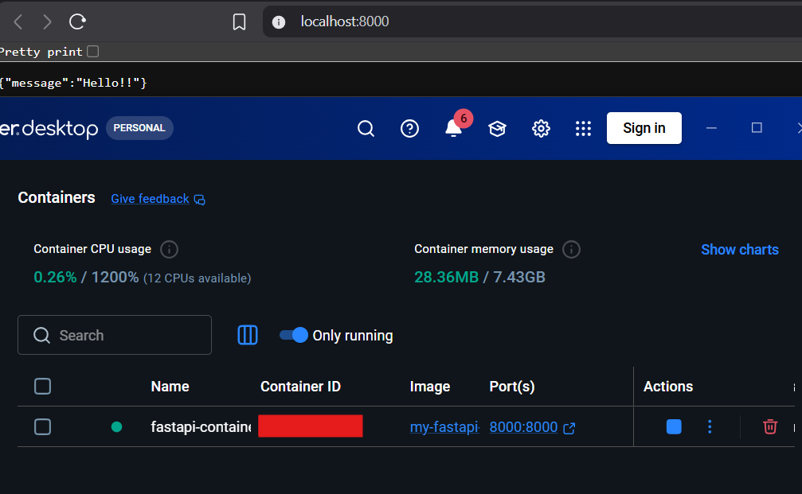
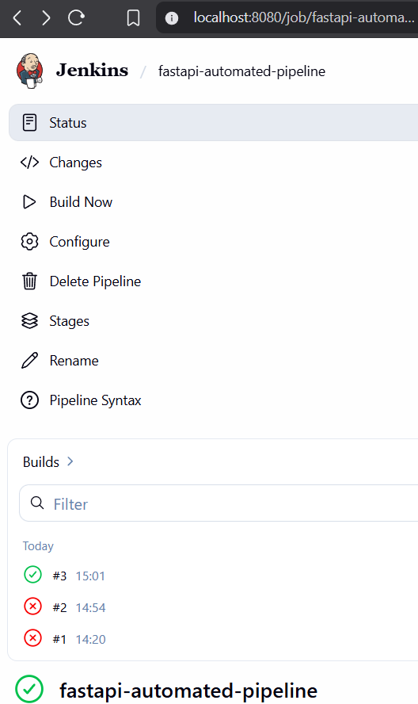

# Automated CI/CD Container Pipeline

**Objective:** Build a fully automated Continuous Integration pipeline that tests and containerizes a Python application upon every repository commit.

## Phase 1: Local Application Foundation
Before automating the deployment, a lightweight FastAPI application was engineered to serve as the test artifact. 

**Actions Completed:**
* Developed a RESTful API using Python and FastAPI.
* Isolated environment dependencies using `requirements.txt`.
* Successfully validated the application locally via a localized ASGI server (Uvicorn).

**Visual Proof: Local Execution**

## Phase 2: Containerization
To ensure environment consistency across all deployments, the application was packaged into a Docker container.

**Actions Completed:**
* Authored a `Dockerfile` utilizing a lightweight Python 3.9 base image.
* Built and tagged a custom Docker image.
* Successfully deployed the containerized application on local port 8000.

**Visual Proof: Docker Execution**

## Phase 3: CI/CD Automation
To orchestrate the build and testing process, a Jenkins declarative pipeline was engineered.

**Actions Completed:**
* Authored a `Jenkinsfile` defining stages for SCM checkout, syntax validation, and container building.
* Configured a local Jenkins server to pull directly from the GitHub repository.
* Successfully executed the automated pipeline, resulting in a verified Docker image build.

**Visual Proof: Pipeline Automation**
