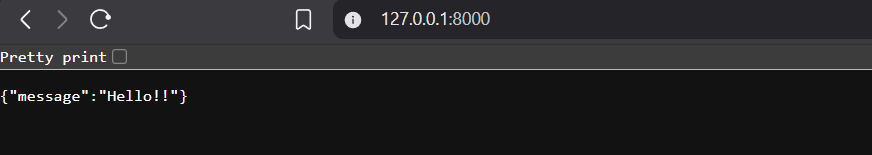

# Automated CI/CD Container Pipeline

**Objective:** Build a fully automated Continuous Integration pipeline that tests and containerizes a Python application upon every repository commit.

## Phase 1: Local Application Foundation
Before automating the deployment, a lightweight FastAPI application was engineered to serve as the test artifact. 

**Actions Completed:**
* Developed a RESTful API using Python and FastAPI.
* Isolated environment dependencies using `requirements.txt`.
* Successfully validated the application locally via a localized ASGI server (Uvicorn).

**Visual Proof: Local Execution**

